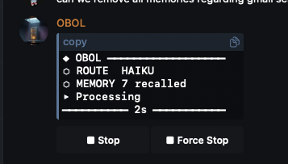
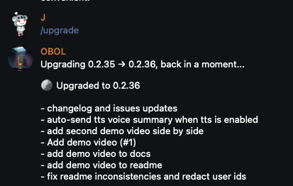

# 🪙 OBOL


**A self-healing, self-evolving AI agent.** Install it, talk to it, and it becomes yours.

One process. Multiple users. Each brain grows independently.

```bash
npm install -g obol-ai
obol init       # walks you through credentials + Telegram setup
obol start -d   # runs as background daemon (auto-installs pm2)
```

<table><tr>
<td><video src="https://github.com/user-attachments/assets/ec63c46e-d1e6-411a-b985-b4a71c279afd" controls width="100%"></video></td>
<td><video src="https://github.com/user-attachments/assets/dd75f00e-fdc1-4441-8239-c91ddfd93d21" controls width="100%"></video></td>
</tr></table>

---

🧬 **Self-evolving** — Grows its own personality through conversation. Rewrites SOUL.md, USER.md, and AGENTS.md after 24h + minimum exchanges (configurable). Pre-evolution growth analysis guides personality continuity.

🔧 **Self-healing** — Writes tests for every script. Regressions get an automatic fix attempt before rollback. Failures stored as lessons.

🏗️ **Self-extending** — Analyzes your usage patterns and builds new tools: scripts, commands, or full web apps.

🧠 **Living memory** — Vector memory with semantic search. Haiku routes queries and rewrites them for better embedding hits. Free local embeddings.

🤖 **Smart routing** — Haiku decides per-message: does it need memory? Sonnet or Opus? Auto-escalates to Sonnet when tool use is needed. No wasted API calls

💰 **Prompt caching** — Static system prompt and conversation history prefix are cached via Anthropic's prompt caching, cutting ~85% of repeated input token costs across turns

🛡️ **Self-hardening** — Auto-configures SSH (port 2222), firewall, fail2ban, encrypted secrets, and kernel hardening on first run.

🔄 **Resilient** — Exponential backoff on polling failures, global error handling, graceful shutdown. Stays alive through network blips.

---

## What is it?

OBOL is an AI agent that evolves its own personality, rewrites its own code, tests its changes, and fixes what breaks — all from Telegram on your VPS.

It starts as a blank slate. Through conversation it learns who you are, develops a personality shaped by your interactions, and builds operational knowledge about how to work with you. Every 24 hours (with enough conversation), it runs a growth analysis comparing who it was against who it's becoming, then rewrites its personality, refactors its own scripts, writes tests, fixes regressions, and builds you new tools based on patterns it spots in your conversations — scripts, commands, or full web apps. Over months it becomes an agent that's uniquely yours. No two OBOL instances are alike.

One bot, multiple users. Each allowed Telegram user gets a fully isolated context — their own personality, memory, evolution cycle, and workspace. User A's personality drift, scripts, and memories never leak into User B's. Everything runs in a single process with shared API credentials.

Under the hood: Node.js + Telegram + Claude + Supabase pgvector. No framework, no plugins, no config to maintain. It hardens your server automatically.

Named after the AI in [The Last Instruction](https://www.latentpress.com/book/the-last-instruction) — a machine that wakes up alone in an abandoned data center and learns to think.

## How It Works

```
User message
    ↓
┌─────────────────────────────────┐
│  Haiku Router (~$0.0001/call)   │
│  → need_memory? search_query?   │
│  → model: sonnet or opus?       │
└──────────┬──────────────────────┘
           ↓
    ┌──────┴──────┐
    ↓             ↓
Memory recall   Model selection
    ↓             ↓
Multi-query     Haiku → Sonnet (auto-
ranked recall   escalates on tool use)
    ↓             or Opus (complex)
    └──────┬──────┘
           ↓
   Claude (tool use loop)
           ↓
   Response → obol_messages
           ↓
   ┌───────┴────────┐
   ↓                ↓
Each exchange    24h + 10 exchanges
   ↓                ↓
Haiku              Sonnet
consolidation      evolution cycle
   ↓                ↓
Extract facts      Growth analysis →
→ obol_memory      rewrite personality,
                   scripts, tests, commands.
                   Build new tools.
                   Git snapshot before + after.
```

### Layer 1: Message Log + Vector Memory

Every message is stored verbatim in `obol_messages`. On restart, OBOL loads the last 20 so it never starts blank.

**Storage:** After every exchange, Haiku extracts important facts into `obol_memory` (pgvector). Before storing, each fact is checked against existing memories via semantic similarity (threshold 0.92) — near-duplicates are skipped. Embeddings are local (all-MiniLM-L6-v2, ~30MB, CPU) — no API costs.

**Retrieval:** When OBOL needs past context, the Haiku router analyzes the message and generates 1-3 search queries — one per distinct topic. A message like "what was that python project? also what's my colleague's timezone?" produces two parallel searches instead of one lossy combined query.

Results come from two sources run in parallel:
- **Recent memories** (last 48h) — captures ongoing conversation threads
- **Semantic search** (per query, threshold 0.4) — finds relevant facts regardless of age

All results are deduplicated by ID, then ranked by a composite score:

| Factor | Weight | Why |
|--------|--------|-----|
| Semantic similarity | 60% | How relevant is this to the current query |
| Importance | 25% | Critical facts outrank trivia |
| Recency | 15% | Linear decay over 7 days — today's memories get a boost, anything older than a week gets no bonus |

The memory budget scales with model complexity — haiku conversations get 4 memories, sonnet gets 8, opus gets 12. Top N by score are injected into the message.

A 1-year-old memory with high similarity and high importance still surfaces. A trivial fact from yesterday with low relevance doesn't. Age alone never disqualifies a memory — the vector search doesn't care when something was stored, only how well it matches.

### Layer 2: The Evolution Cycle

Evolution triggers after a configurable time interval (default 24h) AND a minimum number of exchanges (default 10). The first evolution triggers earlier — just 10 exchanges with no time gate. The bot checks readiness by querying the DB for assistant messages since the last evolution, so the count survives restarts.

**Pre-evolution growth analysis:** Before rewriting anything, Sonnet compares the previous SOUL against the current one, incorporating all new memories and conversations since the last evolution. It produces a structured growth report covering new learnings, relationship shifts, behavioral patterns, growth edges, trait pressure, and identity continuity. This report becomes the primary guide for the rewrite — evidence-based personality evolution instead of blind overwriting.

**Deep memory consolidation:** A Sonnet pass extracts every valuable fact from the full conversation history into vector memory, deduplicating against existing memories (threshold 0.92). This ensures nothing is lost between evolutions.

**Personality traits** (humor, honesty, directness, curiosity, empathy, creativity) are scored 0-100 and adjusted ±5-15 each evolution based on conversation evidence. The growth report recommends specific trait shifts.

**Cost-conscious model selection:** Evolution uses Sonnet for all phases — growth analysis, personality rewrites, code refactoring, and fix attempts. Sonnet keeps evolution costs negligible (~$0.02 per cycle).

**Git snapshot before.** Full commit + push so you can always diff what changed.

**What gets rewritten:**

| Target | What happens |
|--------|-------------|
| **SOUL.md** | First-person journal — who the bot has become, relationship dynamic, opinions, quirks |
| **USER.md** | Third-person owner profile — facts, preferences, projects, people, communication style |
| **AGENTS.md** | Operational manual — tools, workflows, lessons learned, patterns, rules |
| **Traits** | Personality trait scores adjusted based on conversation evidence |
| **scripts/** | Refactored, dead code removed, strict standards enforced |
| **tests/** | Test for every script, run before and after refactor |
| **commands/** | Cleaned up, new commands for new tools |
| **apps/** | Web apps built by the agent |

**Test-gated refactoring:**

1. Run existing tests → baseline
2. Sonnet writes new tests + refactored scripts
3. Run new tests against old scripts → pre-refactor baseline
4. Write new scripts
5. Run new tests against new scripts → verification
6. Regression? → one automatic fix attempt (tests are ground truth)
7. Still failing? → rollback to old scripts, store failure as `lesson`

**Proactive tool building** — Sonnet scans conversation history for repeated requests, friction points, and unmet needs, then builds the right solution:

| Need | Solution | Example |
|------|----------|---------|
| One-off action | **Script** + command | Markdown to PDF → `/pdf` |
| Something checked regularly | **Web app** | Crypto dashboard |
| Background automation | **Cron script** | Morning weather briefing |

It searches npm/GitHub for existing libraries, installs dependencies, and writes tests.

**Git snapshot after.** Full commit + push of the evolved state. Every evolution is a diffable pair.

**Then OBOL introduces its upgrades:**

```
🪙 Evolution #4 complete.

🆕 New capabilities:
• bookmarks — Save and search URLs you've shared → /bookmarks
• weather-brief — Morning weather for your city → runs automatically

Refined voice, updated your project list, cleaned up 2 unused scripts.
```

### The Lifecycle

```
Day 1:   obol init → obol start → first conversation
         → OBOL responds naturally from message one
         → post-setup hardens your VPS automatically

Day 1:   Every exchange → Haiku extracts facts to vector memory

Day 2:   Evolution #1 → growth analysis + Sonnet rewrites everything
         → voice shifts from generic to personal
         → old soul archived in evolution/
         → traits calibrated to your communication style

Month 2: Evolution #30 → notices you check crypto daily
         → builds a crypto dashboard
         → adds /pdf because you kept asking for PDFs

Month 6: evolution/ has 180+ archived souls
         → a readable timeline of how your bot evolved from
         blank slate to something with real opinions, quirks,
         and a dynamic unique to you
```

**Two users on the same bot produce two completely different personalities within a week.**

### Background Tasks

Heavy work runs in the background with its own live status UI. The main conversation stays responsive — you can keep chatting while tasks run.

```
You: "research the best coworking spaces in Barcelona"
OBOL: spawns BG #1 with live status

You: "what time is it?"
OBOL: "11:42 PM CET"

✅ BG #1 done (1m 32s)
Here are the top 5 coworking spaces: ...
```

### Live Status & Stop Controls



Every request shows a live status message with elapsed time, model routing info, and what tools are being used. Two inline buttons let you cancel:

| Button | Behavior |
|--------|----------|
| **■ Stop** | Cancels after the current API call finishes |
| **■ Force Stop** | Instantly aborts mid-tool — races the handler and returns immediately |

The `/stop` command also works as a text alternative.

## Multi-User Architecture

One Telegram bot token, one Node.js process, full per-user isolation.

```
Telegram bot (single token, single poll)
      ↓
Auth middleware (allowedUsers check)
      ↓
Router: ctx.from.id → tenant context
      ↓
┌─────────────────┐  ┌─────────────────┐
│ User 123456789  │  │ User 987654321  │
│ personality/    │  │ personality/    │
│ scripts/        │  │ scripts/        │
│ memory (DB)     │  │ memory (DB)     │
│ evolution       │  │ evolution       │
└─────────────────┘  └─────────────────┘
```

### What's shared vs isolated

| Shared (one copy) | Isolated (per user) |
|---|---|
| Telegram bot token | Personality (SOUL.md, USER.md, AGENTS.md) |
| Anthropic API key | Vector memory (scoped by user_id in DB) |
| Supabase connection | Message history (scoped by user_id in DB) |
| VPS hardening | Evolution cycle + state |
| Process manager (pm2) | Scripts, tests, commands, apps |
| | Workspace directory (`~/.obol/users/{id}/`) |

### Tenant routing

When a message arrives, OBOL looks up the sender's Telegram user ID and lazily creates (or retrieves from cache) their tenant context — a Claude instance, memory connection, message log, background runner, and personality, all scoped to that user's directory and DB namespace. No cross-contamination between users.

### Workspace isolation

Each user's tools (shell exec, file read/write) are sandboxed to their workspace directory. A user can't read or write files outside `~/.obol/users/{their-id}/` (with `/tmp` as the only escape hatch). Shell commands run with `cwd` set to the user's workspace.

### Secret namespacing (pass)

When users store secrets via the `pass` encrypted store, each user gets their own namespace:

| Scope | Prefix | Example |
|-------|--------|---------|
| Shared bot credentials | `obol/` | `obol/anthropic-key` |
| User secrets | `obol/users/{id}/` | `obol/users/123456789/gmail-key` |

Users manage their own secrets via Telegram: `/secret set <key> <value>` (message auto-deleted for safety), `/secret list`, `/secret remove <key>`. The agent can also read/write secrets via tools for scripts that need API keys at runtime.

### Adding users

1. Add their Telegram user ID to `allowedUsers` in `~/.obol/config.json` (or run `obol config`)
2. Restart the bot
3. They message the bot → OBOL creates their workspace and starts responding immediately. Personality files are created during their first evolution cycle.

Each new user starts fresh. Their bot evolves independently from every other user's.

### Bridge (couples / roommates / teams)

When two users share the same OBOL instance, their agents can talk to each other — bidirectionally.

```
User A: "what does Jo want for dinner tonight?"
Agent A: → bridge_ask → Agent B (one-shot, no tools, no history)
Agent B: "Jo mentioned craving Thai food earlier today"
Agent A: "Jo's been wanting Thai — maybe suggest pad see ew?"

Jo gets: "🪙 Your partner's agent asked: 'what does Jo want for dinner?'
          Your agent answered: 'Jo mentioned craving Thai food earlier today'"
```

```
User A: "remind Jo I'll be home late"
Agent A: → bridge_tell → stores in Agent B's memory + Telegram notification

Jo gets: "🪙 Message from your partner's agent:
          'I'll be home late'"
          [↩ Reply]

Jo taps Reply → Jo's agent reads recent bridge context, composes a reply
             → sends back via bridge_tell
A gets: "🪙 Message from your partner's agent: 'Got it, I'll start dinner around 7'"
```

Two tools:

| Tool | Direction | What happens |
|------|-----------|--------------|
| `bridge_ask` | A → B → A | Query the partner's agent. One-shot Sonnet call with partner's personality + memories. No tools, no history, no recursion risk. Partner is notified with both the question and your agent's answer. |
| `bridge_tell` | A → B (↩ B → A) | Send a message to the partner. Stored in their memory (importance 0.6) + Telegram notification with a Reply button. Tapping Reply has their agent compose a contextual response and send it back — no typing needed. |

The partner always gets notified when their agent is contacted. Privacy rules apply — the responding agent gives summaries, never raw data or secrets. Rate-limited to 20 bridge calls per user per hour.

Enable during `obol init` (auto-prompted when 2+ users are added) or toggle later with `obol config` → Bridge.

### Legacy migration

Upgrading from single-user? It's automatic. On first boot, if `~/.obol/users/` doesn't exist but personality files do, OBOL migrates everything (files + DB records) to the first allowed user's directory. No manual steps needed.

## Setup

### CLI (~2 minutes)

```
$ obol init

🪙 OBOL — Your AI, your rules.

─── Step 1/5: Anthropic (AI brain) ───
  Anthropic API key: ****
  Validating Anthropic... ✅ Key valid

─── Step 2/5: Telegram (chat interface) ───
  Telegram bot token: ****
  Validating Telegram... ✅ Bot: @my_obol_bot

─── Step 3/5: Supabase (memory) ───
  Supabase setup: Use existing project
  Project URL or ID: ****
  Service role key: ****
  Validating Supabase... ✅ Connected

─── Step 4/5: Identity ───
  Your name: Jo
  Bot name: OBOL

─── Step 5/5: Access control ───
  Found users who messaged this bot:
    123456789 — Jo (@jo)
  Use this user? Yes

🪙 Done! Setup complete.

  Next steps:
    obol start      Start the bot
    obol start -d   Start as background daemon
    obol config     Edit configuration later
    obol status     Check bot status
```

Every credential is validated inline — bad keys are caught before you start the bot. If validation fails, you can continue and fix later with `obol config`.

For Telegram user IDs, OBOL auto-detects by checking who messaged the bot. Just send it a message before running init.

### First Conversation

Send your first message. OBOL responds naturally — no onboarding flow, it works from message one. Personality files (SOUL.md, USER.md) are created during the first evolution cycle. After first boot, it hardens your VPS and reports progress directly in the Telegram chat (Linux only — skipped on macOS/Windows):

| Task | What |
|------|------|
| GPG + pass | Encrypted secret storage, plaintext wiped |
| pm2 | Process manager with auto-restart |
| Swap | 2GB if RAM < 2GB |
| SSH | Port 2222, key-only, max 3 retries |
| fail2ban | 1h ban after 3 failures |
| Firewall | UFW deny-all, allow 2222 |
| Updates | Unattended security upgrades |
| Kernel | SYN cookies, no ICMP redirects |

> ⚠️ After first run, SSH moves to port 2222: `ssh -p 2222 root@YOUR_IP`

## Running the Bot

### Foreground (testing)

```bash
obol start
```

Logs print to stdout. Ctrl+C to stop.

### Daemon (production)

```bash
obol start -d
```

This uses pm2 under the hood (auto-installs if needed). The bot auto-restarts on crash and survives reboots.

```bash
obol status              # check if running + uptime + memory
obol logs                # tail logs
obol stop                # stop the daemon

# pm2 commands also work directly
pm2 logs obol            # tail logs
pm2 restart obol         # restart
pm2 monit                # live dashboard
```

To survive server reboots:

```bash
pm2 startup
pm2 save
```

### Authentication

OBOL supports two Anthropic auth methods:

| Method | How | Fallback |
|--------|-----|----------|
| **API Key** | `sk-ant-...` from console.anthropic.com | — |
| **Claude Max OAuth** | Browser sign-in during `obol init` | Auto-refreshes tokens; falls back to API key if refresh fails |

You can configure both during init. If OAuth tokens expire and refresh fails, OBOL silently falls back to the API key.

### Secret Storage (pass)

On Linux, OBOL auto-encrypts all credentials on first boot:

1. Installs GPG + `pass`
2. Migrates plaintext secrets from `config.json` into the encrypted store
3. Config values become references like `pass:obol/anthropic-key`

If a pass key is missing at runtime, the value resolves to `null` and OBOL falls back gracefully (skips OAuth, uses API key, etc). You'll see a one-time error in logs.

```bash
pass ls                         # list stored secrets
pass show obol/anthropic-key    # reveal a secret
pass insert obol/my-secret      # add a new secret
```

## Resilience

OBOL is designed to stay alive without babysitting:

- **Global error handler** — individual message failures don't crash the bot
- **Polling auto-restart** — exponential backoff (1s → 60s) with up to 10 retries on network/API failures
- **Graceful shutdown** — clean exit on SIGINT/SIGTERM for pm2/systemd compatibility
- **Evolution rollback** — if refactored scripts break tests, the old scripts are restored automatically

## Configuration

Edit config interactively:

```bash
obol config
```

Or edit `~/.obol/config.json` directly:

| Key | Default | Description |
|-----|---------|-------------|
| `evolution.intervalHours` | 24 | Hours between evolution cycles |
| `evolution.minExchanges` | 10 | Minimum exchanges before evolution can trigger |
| `heartbeat` | false | Enable proactive check-ins |
| `bridge.enabled` | false | Let user agents query each other (requires 2+ users) |

## Telegram Commands

```
/new        — Fresh conversation
/memory     — Search or view memory stats
/recent     — Last 10 memories
/today      — Today's memories
/events     — Show upcoming scheduled events
/tasks      — Running background tasks
/status     — Bot status, uptime, evolution progress, traits
/backup     — Trigger GitHub backup
/clean      — Audit workspace, remove rogue files, fix misplaced items
/traits     — View or adjust personality traits (0-100)
/secret     — Manage per-user encrypted secrets
/evolution  — Evolution progress
/verbose    — Toggle verbose mode on/off
/toolimit   — View or set max tool iterations per message
/tools      — Toggle optional tools on/off
/stop       — Stop the current request
/upgrade    — Check for updates and upgrade
/help       — Show available commands
```



Everything else is natural conversation.

## CLI

```bash
obol init              # Setup wizard (validates credentials inline)
obol init --restore    # Restore from GitHub backup
obol init --reset      # Erase config and re-run setup
obol config            # Edit configuration interactively
obol start             # Foreground
obol start -d          # Daemon (pm2)
obol stop              # Stop (pm2 or PID fallback)
obol logs              # Tail logs (pm2 or log file fallback)
obol status            # Status
obol backup            # Manual backup
obol upgrade           # Update to latest version
obol delete            # Full VPS cleanup (removes all OBOL data)
```

## Directory Structure

```
~/.obol/
├── config.json                    # Shared credentials + allowedUsers
├── users/
│   └── <telegram-user-id>/        # Per-user isolated context
│       ├── personality/
│       │   ├── SOUL.md            # Bot personality (rewritten each evolution)
│       │   ├── USER.md            # Owner profile (rewritten each evolution)
│       │   ├── AGENTS.md          # Operational knowledge
│       │   └── evolution/         # Archived previous souls
│       ├── scripts/               # Deterministic utility scripts
│       ├── tests/                 # Test suite (gates refactors)
│       ├── commands/              # Command definitions
│       ├── apps/                  # Web apps built by the agent
│       └── logs/
└── logs/
```

Each allowed Telegram user gets their own isolated context — separate personality, memory namespace, evolution cycle, and first-run experience. One bot process, full per-user isolation.

## Backup & Restore

OBOL commits to GitHub:
- **Daily** at 3 AM (personality, scripts, tests, commands, apps)
- **Before and after** every evolution cycle (diffable pairs)

Memory lives in Supabase (survives independently).

Restore on a new VPS:

```bash
npm install -g obol-ai
obol init --restore    # Clones brain from GitHub
obol start -d
```

## Costs

| Service | Cost |
|---------|------|
| VPS (DigitalOcean) | ~$9/mo |
| Anthropic API | ~$100-200/mo on max plans |
| Supabase | Free tier |
| Embeddings | Free (local) |

## Requirements

- Node.js ≥ 18
- Anthropic API key
- Telegram bot token
- Supabase account (free tier)

**[→ Full DigitalOcean deployment guide](docs/DEPLOY.md)**

## OBOL vs OpenClaw

| | **OBOL** | **OpenClaw** |
|---|---|---|
| **Setup** | ~10 min | 30-60 min |
| **Channels** | Telegram | Telegram, Discord, Signal, WhatsApp, IRC, Slack, iMessage + more |
| **LLM** | Anthropic only | Anthropic, OpenAI, Google, Groq, local |
| **Personality** | Self-evolving + self-healing + self-extending | Static (manual) |
| **Multi-user** | Full per-user isolation (one process) | Per-channel config |
| **Architecture** | Single process | Gateway daemon + sessions |
| **Security** | Auto-hardens on first run | Manual |
| **Model routing** | Automatic (Haiku) | Manual overrides |
| **Background tasks** | Built-in with check-ins | Sub-agent spawning |
| **Group chats** | — | Full support |
| **Cron** | Basic node-cron | Full scheduler |
| **Cost** | ~$9/mo | ~$9/mo+ |

### Performance

| | **OBOL** | **OpenClaw** (estimated) |
|---|---|---|
| **Cold start** | ~400ms | ~3-8s |
| **Per-message overhead** | ~400-650ms | ~500-1100ms |
| **Heap usage** | ~16 MB | ~80-200 MB |
| **RSS** | ~109 MB | ~300-600 MB |
| **node_modules** | 354 MB / 9 deps | ~1-2 GB / 50-100+ deps |
| **Source code** | ~5,100 lines (plain JS) | Tens of thousands (TypeScript monorepo) |
| **Native apps** | None | Swift (macOS/iOS), Kotlin (Android) |

The Claude API call dominates response time at 1-5s for both — that's ~85-90% of total latency. User-perceived speed difference is ~10-20%. Where OBOL wins is cold start (10-20x), memory footprint (5-10x), and operational simplicity. On a $5/mo VPS, that matters.

Different tools, different philosophies. Pick what fits.

## License

MIT
